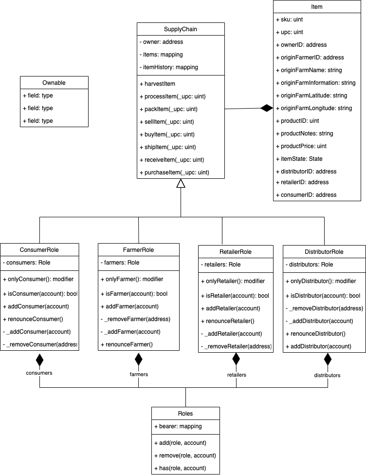
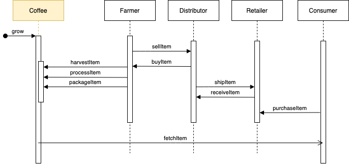
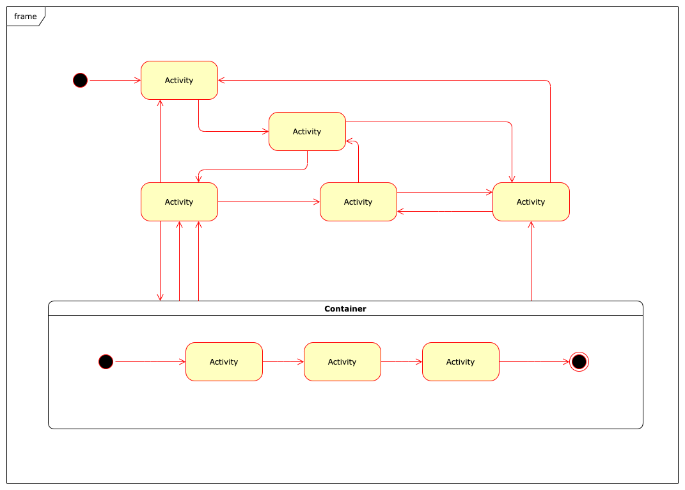
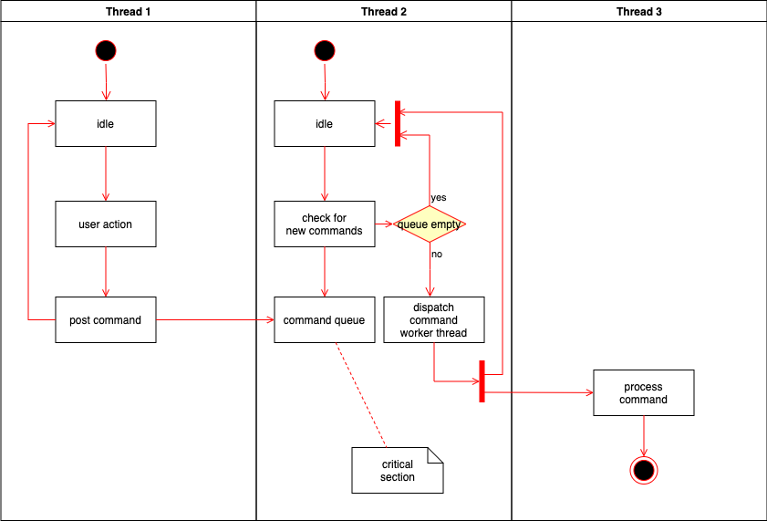

## Overview

Repository contains sample Ehtrum DApp that implements basic supplychain. Chain includes four different roles that can transact and verify authenticity using on-chain data.

* Farmer can only: HARVEST, PROCESS, PACK, SELL
* Distributor can only: BUY, SHIP
* Retailer can only: RECEIVE
* Consumer: PURCHASE

## Diagrams

### Class Diagram:

### Sequence Diagram:

### State Diagram:

### Activity Diagram:

## Preview

**CURRENT:** live version of contract: [ETHERSCAN](https://rinkeby.etherscan.io/address/0x0b0f0D2C24E795133Bf66a977B1F8e9d73759429)

## Versions Used:

* Node - v10.20.1
* Solidity - v0.5.17
* Truffle - v5.1.37
* OpenZeppelin - v2.1.2
* Web3 - v1.2.1

## Getting Started

These instructions will get you a copy of the project up and running on your local machine for development and testing purposes. See deployment for notes on how to deploy the project on a live system.

## Built With

* [Ethereum](https://www.ethereum.org/) - Ethereum is a decentralized platform that runs smart contracts
* [IPFS](https://ipfs.io/) - IPFS is the Distributed Web | A peer-to-peer hypermedia protocol
to make the web faster, safer, and more open.
* [Truffle Framework](http://truffleframework.com/) - Truffle is the most popular development framework for Ethereum with a mission to make your life a whole lot easier.
* Starter code was provided by [Udacity](https://github.com/udacity/nd1309-Project-6b-Example-Template)